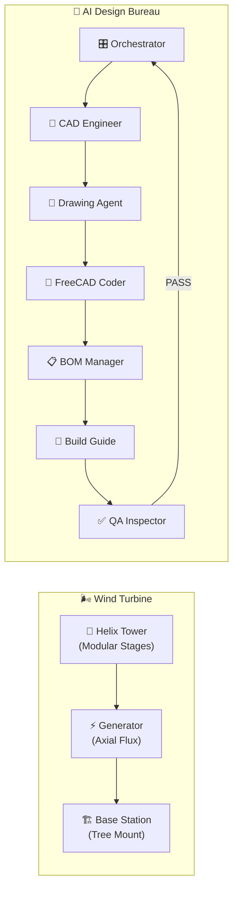

<p align="center">
  
  
  
  
</p>

<h1 align="center">🌬️ WindPower-3D</h1>
<h3 align="center">Open-Source Savonius Helix Wind Generator — Fully 3D Printable</h3>

<p align="center">
  <strong>Parametric • Modular • AI-Orchestrated Design Bureau</strong><br/>
  Erzeuge deinen eigenen Strom mit einem 3D-gedruckten Windgenerator.<br/>
  <em>Generate your own power with a fully 3D-printed wind generator.</em>
</p>

---

## ⚡ Was ist WindPower-3D?

Ein **vollständig 3D-druckbarer Savonius-Helix Windgenerator** mit integriertem XXL Axialfluss-Generator. Designed für den Bambu Lab P1S (256×256mm), aber kompatibel mit jedem FDM-Drucker.

### 🌟 Features

| Feature | Details |
|---------|---------|
| 🔄 **Modularer Turm** | Stapelbare Helix-Etagen mit 12-Zahn Vielzahn-Kupplung |
| ⚡ **XXL Generator** | 180mm Rotoren, 20-Pol, ovale Capsule-Spulen (40×26mm!) |
| 🏗️ **XXL Basis-Station** | 220mm Ø, Stacking-Deckel, Wartungsklappe, wasserdichte Bodenwanne |
| 🔧 **Profi-Werkzeuge** | Traversier-Wickelmaschine, Magnet-Puffer, Akkuschrauber-Aufsatz |
| 📐 **Parametrisches Design** | Alle Maße in JSON — ändere eine Zahl, alles passt sich an |
| 🤖 **AI Design Bureau** | 7 spezialisierte Agenten orchestrieren den Konstruktions-Workflow |
| 📋 **Lebende BOM** | Stückliste aktualisiert sich automatisch bei Änderungen |
| 📖 **Bauanleitungen** | Schritt-für-Schritt auf Deutsch mit Sicherheitshinweisen |

---

## 🏗️ System-Architektur



---

## 📦 Baugruppen / Assemblies

### 🗼 Helix-Turm
Modulares Stecksystem mit 12-Zahn Vielzahn-Kupplung. Jede Etage: 2 Helix-Flügel (90° Twist), 1 Skelett-Verbinder, 1 Achsen-Plug.

### ⚡ XXL Axialfluss-Generator *(NEU v2!)*
Sandwich-Bauweise mit **180mm Rotoren** und **ovalen Capsule-Spulen** (40×26mm statt runde Ø14mm). 20 Neodym-Magnete auf R74mm Kreis für massives Drehmoment. Leichtbau-Skelettierung für weniger Filament und bessere Kühlung.

### 🏗️ XXL Basis-Station *(NEU v2!)*
**220mm Ø Gehäuse** mit 50mm Kegelrollenlager (real gemessen!), Stacking-Deckel, 3× Wand-Flansche, wasserdichte Bodenwanne und Elektronik-Wartungsklappe mit Backpack-Gehäuse.

### 🔧 Werkzeuge *(Erweitert v2!)*
- **Easy-Tool**: Akkuschrauber-Aufsatz zum schnellen Spulenwickeln
- **Komplex-Spooler**: Professionelle Traversier-Wickelmaschine (1:24 Zahnrad-Untersetzung, 4 Achsen, Skeleton-Basis)
- **Magnet-Puffer**: Magnetischer Drahtspanner mit T-Nut-Schiene und Filz-Bremse

---

## 🚀 Quick Start

### 1. Repository klonen
```bash
git clone https://github.com/YOUR_USERNAME/windpower-3d.git
cd windpower-3d
```

### 2. Stückliste prüfen
→ [`docs/bom/master_bom.md`](docs/bom/master_bom.md) — Alle Druck- und Kaufteile

### 3. Drucken
Öffne die STL-Dateien aus `exports/` in deinem Slicer. Empfohlenes Material: **PETG**.

### 4. Bauen
→ [`docs/build-guide/`](docs/build-guide/README.md) — Schritt-für-Schritt Anleitungen

### 5. FreeCAD Scripts laden (optional)
```python
# In FreeCAD Python Console einmal pasten:
exec(open("windpower-3d/freecad_loader.py").read())

# Dann jedes Script laden:
run("bigBasis/big_base_station")       # XXL Basis
run("bigBasis/big_base_generator")      # XXL Generator
run("Helix_Leaf+Connector")             # Turm
run("tools/komplexSPooler/Traversier-Basis & Skeleton")  # Wickelmaschine
```

---

## 📋 Stückliste (Kurzfassung)

| Kategorie | Menge (XXL, 3 Etagen) |
|-----------|:---------------------:|
| 🖨️ Druckteile (Hauptanlage) | 29 Stück |
| 🖨️ Druckteile (Werkzeuge) | 3–22 Stück |
| 🔩 Einschmelzmuttern + Schrauben | ~52 Stück |
| 🧲 Neodym-Magnete (20×5×3mm) | **40 Stück** |
| ⚙️ Kegelrollenlager (29×50×15) | 1 Stück |
| 📏 Vierkant-Achse (10×10mm) | 1 Stück |
| 🔌 Kupferlackdraht (Ø0.5mm) | ~100m |
| 📦 Geschätztes Filament | ~1.5kg PETG |

→ [**Vollständige Stückliste**](docs/bom/master_bom.md)

---

## 🤖 AI Design Bureau

Dieses Projekt nutzt ein **KI-Agenten-System** inspiriert von [agency-agents](https://github.com/msitarzewski/agency-agents) und [claude-agent-blueprint](https://github.com/mongoistkeingemuese/claude-agent-blueprint).

### 7 Spezialisierte Agenten

| Agent | Aufgabe |
|-------|---------|
| 🎛️ **Orchestrator** | Pipeline-Management, Quality Gates, Retry-Logik |
| 📐 **CAD Engineer** | Parametrisches Design, Toleranzen, Druckbarkeit |
| 📏 **Drawing Agent** | 3-Ansichten-Zeichnungen (Front, Seite, Draufsicht) |
| 🐍 **FreeCAD Coder** | Python-Scripts, STL-Export, parametrische Geometrie |
| 📋 **BOM Manager** | Stückliste pflegen (JSON + Markdown) |
| 📖 **Build Guide Author** | Bauanleitungen auf Deutsch |
| ✅ **QA Inspector** | Vollständigkeits- und Konsistenzprüfung |

### Design-Pipeline

```
📐 Design → 📏 3-Ansichten → 🐍 FreeCAD Code → 📋 BOM Update → 📖 Bauanleitung → ✅ QA
     ↑                                                                                  │
     └──────────────────────── Feedback bei FAIL ──────────────────────────────────────┘
```

→ [**Architektur-Details**](docs/ARCHITECTURE.md)

---

## 📂 Projektstruktur

```
windpower-3d/
├── .agents/                    # 🤖 AI Agent System
│   ├── identities/             #    7 Agenten-Identitäten
│   ├── workflows/              #    Pipeline-Definitionen (JSON)
│   └── state.json              #    Orchestrator-Status
├── assemblies/                 # 📦 Baugruppen-Metadaten
│   ├── tower/                  #    🗼 Helix-Turm
│   ├── xl-base-station/        #    🏗️ XXL Basis-Station (AKTIV)
│   ├── xl-generator/           #    ⚡ XXL Generator (AKTIV)
│   ├── base-station/           #    📦 Legacy Kleine Basis
│   ├── generator/              #    📦 Legacy Generator
│   └── tools/                  #    🔧 4× Werkzeug-Sets
├── shared/                     # 🔗 Geteilte Ressourcen
│   ├── parameters.json         #    Zentrale Parameter-Registry (v2)
│   ├── freecad_utils.py        #    FreeCAD Utilities (inkl. Capsule!)
│   ├── materials.json          #    Material-Definitionen
│   └── fasteners.json          #    Verbindungselemente-Katalog
├── src/                        # 💻 FreeCAD Scripts
│   ├── bigBasis/               #    🏗️ XXL Basis + Generator
│   ├── smalBasis/              #    📦 Legacy (kleine Variante)
│   ├── tools/                  #    🔧 Werkzeuge
│   │   ├── komplexSPooler/     #       Traversier-Wickelmaschine
│   │   ├── firstSpooler/       #       Original-Wickler
│   │   ├── magnetPuffer/       #       Drahtspanner
│   │   └── easy_tool_*         #       Akkuschrauber-Aufsatz
│   └── Helix_Leaf+Connector.py #    🗼 Turm-Flügel
├── exports/                    # 📤 STL/3MF Exporte
├── freecad_loader.py           # 🚀 FreeCAD Script-Loader
├── docs/                       # 📚 Dokumentation
└── README.md                   #    ← Du bist hier
```

---

## 🛠️ Für Entwickler / FreeCAD Anpassungen

### Parameter ändern
Alle Maße sind zentral in [`shared/parameters.json`](shared/parameters.json) definiert:

```json
{
  "tower": {
    "blatt_radius": { "value": 66.0, "unit": "mm", "desc": "Helix-Blatt Radius" },
    "twist_winkel": { "value": 90.0, "unit": "deg", "desc": "Helix-Drehwinkel" }
  }
}
```

### Utility-Funktionen
[`shared/freecad_utils.py`](shared/freecad_utils.py) enthält alle gemeinsam genutzten Funktionen:
- `make_square_prism()` — Vierkant-Achsloch
- `make_vielzahn_prism()` — 12-Zahn Kupplung
- `make_capsule()` — Ovale Spulen-Form *(NEU v2)*
- `make_centered_box()` — Zentrierter Quader *(NEU v2)*
- `create_capsule_array()` — Kreisförmige Capsule-Muster *(NEU v2)*
- `create_circular_array()` — Kreisförmige Zylinder-Muster
- `load_parameters()` — Parameter aus JSON laden

---

## 🤝 Mitmachen / Contributing

Wir freuen uns über Beiträge! Siehe [`CONTRIBUTING.md`](CONTRIBUTING.md) für Details.

### Möglichkeiten
- 🐛 **Bugs melden** — Toleranzen, Passungsprobleme, Druckfehler
- 📐 **Design verbessern** — Neue Varianten, bessere Geometrie
- 📖 **Dokumentation** — Bauanleitungen, Übersetzungen
- 🤖 **Agenten** — Neue Fähigkeiten, bessere Learnings
- 🌍 **Übersetzungen** — Build-Guide in andere Sprachen

---

## 📜 Lizenz

MIT License — siehe [LICENSE](LICENSE)

---

<p align="center">
  <strong>🌬️ Erzeuge deinen eigenen Strom. Open Source. Druckbar. Modular.</strong><br/>
  <em>Made with ❤️ and a lot of PETG</em>
</p>
